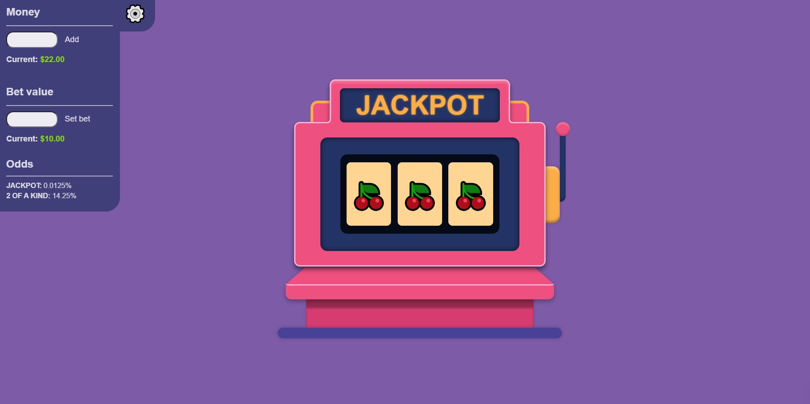

# 🎰 Slot Machine Project

Um projeto de **máquina caça-níqueis** desenvolvido com **TypeScript**, **Vite** e **gRPC**, incluindo animações, gerenciamento de apostas e saldo persistente em cookies.

## ✨ Funcionalidades

-   🎨 Interface estilizada com HTML + CSS
-   🎰 Três rolos com lista de símbolos (emojis)
-   🎬 Animação de rotação dos rolos ao puxar a alavanca
-   💰 Gerenciamento de dinheiro (saldo salvo em cookies)
-   🎲 Definição do valor da aposta (também salvo em cookies)
-   🏆 Destaque visual ao ganhar **2 of a kind** ou **Jackpot**
-   ⚙️ Painel lateral de configurações com odds e botões de controle

## 📸 Screenshot



## 🛠️ Tecnologias

-   [Vite](https://vitejs.dev/)
-   [TypeScript](https://www.typescriptlang.org/)
-   [gRPC](https://grpc.io/) com Node.js
-   [Express](https://expressjs.com)
-   HTML + CSS

## 🚀 Como executar

### 1. Clone o repositório

```bash
git clone https://github.com/seu-usuario/RPC_SistemasDistribuidos.git
cd RPC_SistemasDistribuidos
```

### 2. Instale as dependências

```bash
npm install
```

### 3. Rode o servidor

```bash
npm run server
```

### 4. Rode o client

```bash
npm run client
```

Depois abra o navegador em `http://localhost:5173` (ou a porta configurada pelo Vite).
